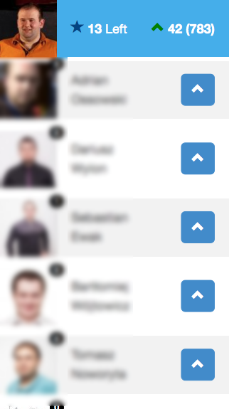
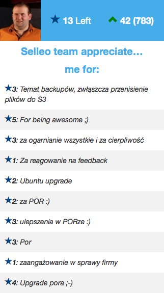
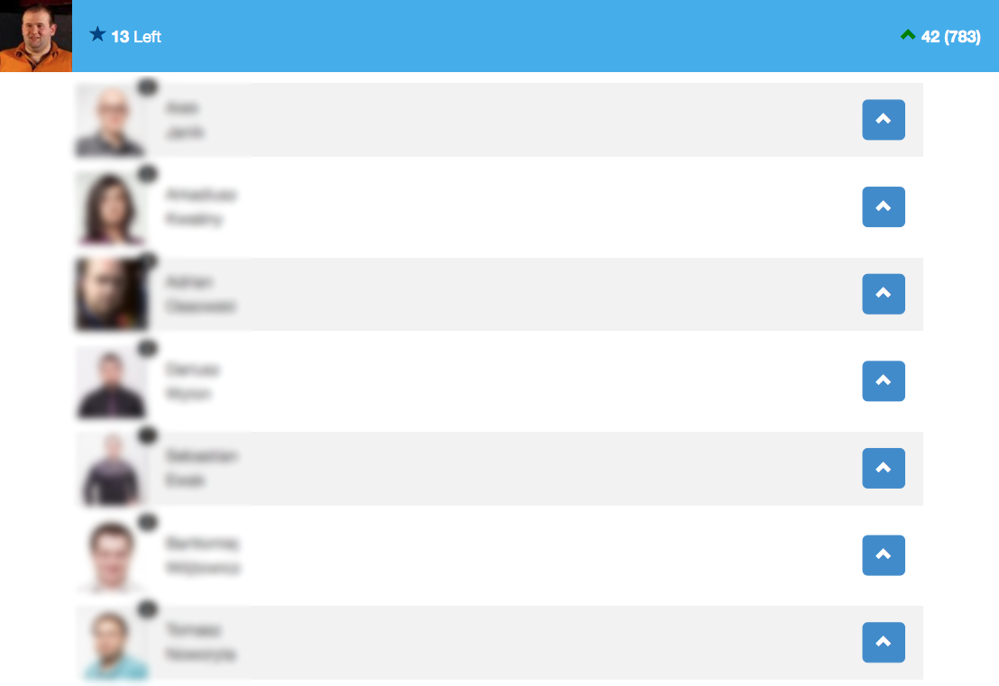
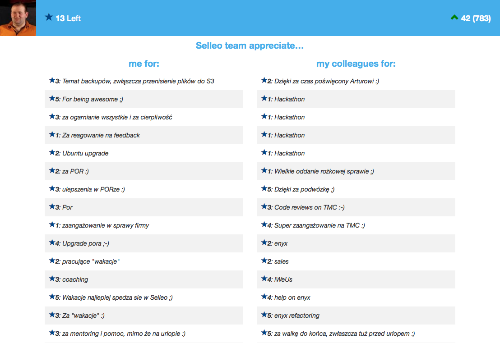
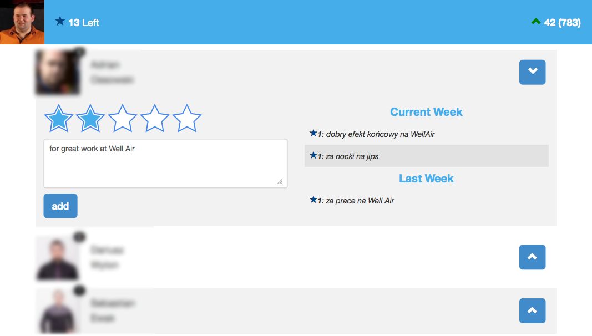

# Merit Money

**Merit Money** is an application for giving *kudos* to co-workers. Every Monday each co-worker gets 20 kudos to spend.
Undistributed kudos are lost on Sunday at midnight.
There is no restrictions. For example Wolly can give 5 kudos to James because he helped him with solving very difficult
task. On the other side Sue can give Alice one kudo (or ’x’ kudos) just for the sake of being nice to others. It is up to you.
It should be up to you. The more the freedom and free rein, the more powerful the idea is.

You can find more about Merit Money [here](http://www.management30.com/workout/merit-money/).

## Successful Use Case
Merit Money app has been implemented with success in Poland-based agile and successful software house, [Selleo](http://selleo.com). Their
employees use it on a daily basis.

> One of the most awesome momement I look forward to every Monday is to 
> launch the app and see how many kudos I got and
> for what. Reading colleagues’ comments did raise my overall happiness says > one of the developers.

Management claims that the solution introduced **a lot more transparency** in the company.

## Development

Merit Money uses the following and cutting-edge technologies:

### Backend
- Ruby version 1.9.3
- Rails version 3.2.12
- SQLite with ActiveRecord.
- Template Engine: ERB
- Testing Framework: RSpec and Factory Girl
- Form Builder: SimpleForm
- Authentication: OmniAuth

### Front-end
- Twitter Bootstrap
- Ember.js
- Ember Data
- CoffeeScript
- Sass

### Other
- Google account for authentication
- Gravatar account (optional)

## Getting Started

* Install rvm and ruby 1.9.3
* Fetch repository and run bundle
* cp config/database.yml.example config/database.yml
* rake db:create
* rake db:migrate
* rails s

## Documentation and Support
## Credits

## License
**MIT**

